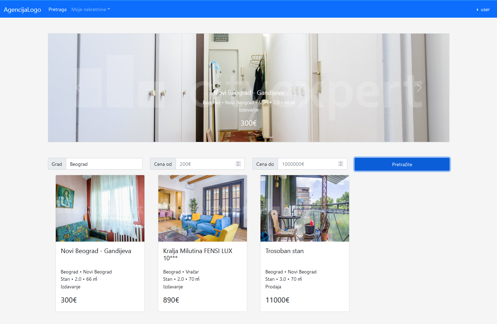
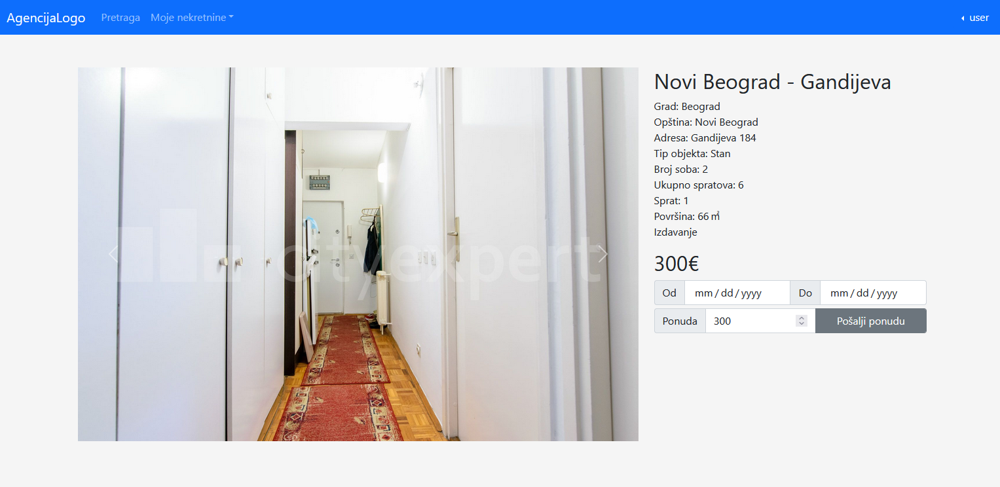
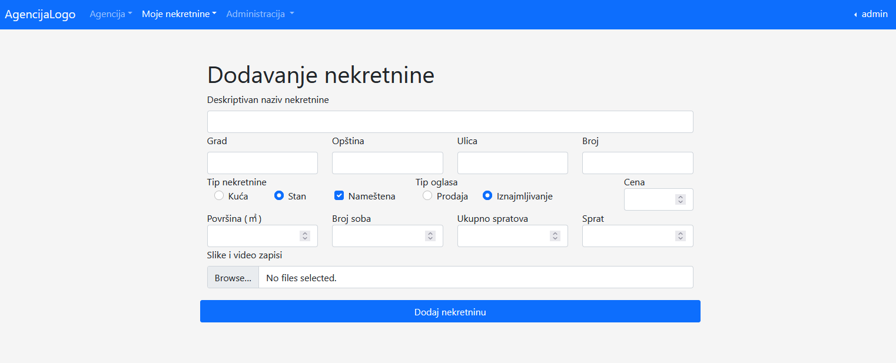
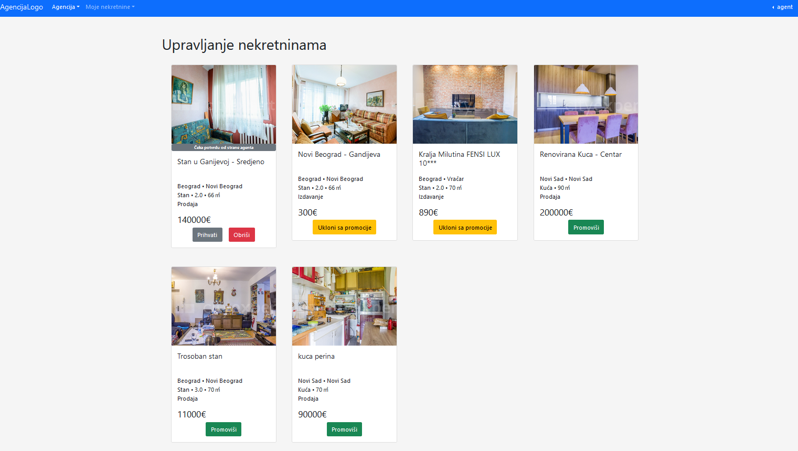
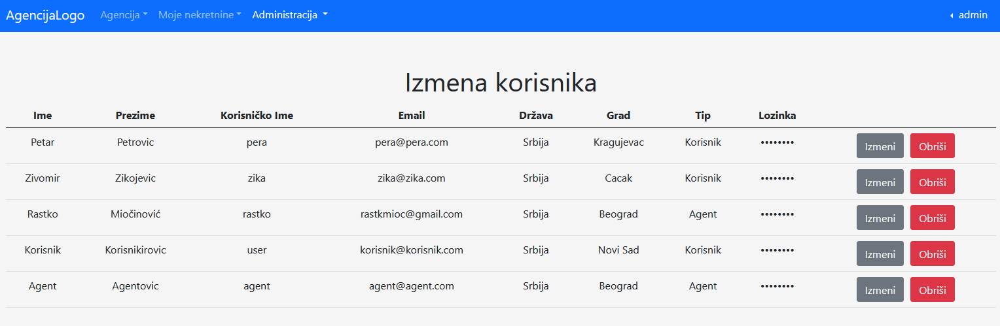
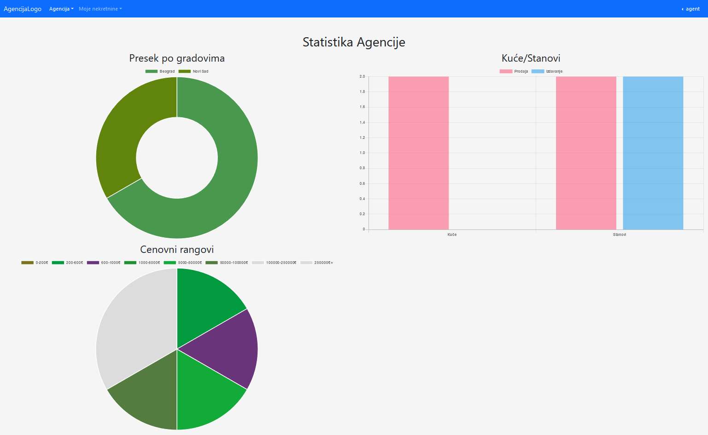
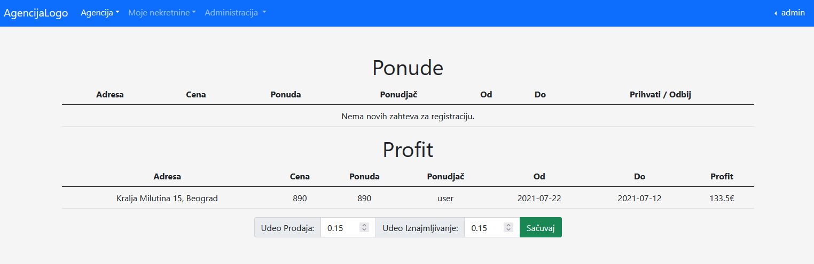
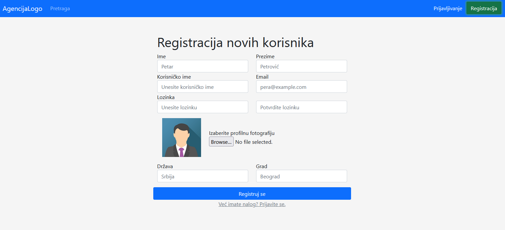

# realaSale

  

## Project Description
This project is a fully functional web application for advertising the renting and sale of realastate created using the MEAN stack.

The app supports role based authentication. The different roles are:
* **Users** can interract with different realastate and list their own for sale/rent. They can search all the realestate using different criteria including price price range and rent/sale. Offers can also be sent to the agency and other users for confirmation.
* **Agents** can manage all realastate in the system and list their own for sale/rent. They can also confirm/deny the different requests and see the agency statistics.
* **The Administrator**, in addition to the functionality of the agent, has a wide range of user management options, including the creation, deletion and update of both normal users and agents. The administrator can also confirm/deny new user requests.

The frontend was created using Angular. The backend is written in TypeScript. Bootstrap and Chart.js were also used. The app uses a MongoDB database.

The application also has additional functionality explained in the original project specification pdf (only available in Serbian).

This project was completed in the summer of 2021 as part of the Internet Application Programming course at the University Of Belgrade School of Electrical Engineering (ETF).

## More screenshots

  

  

  

  

  

  

  
